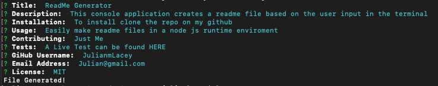
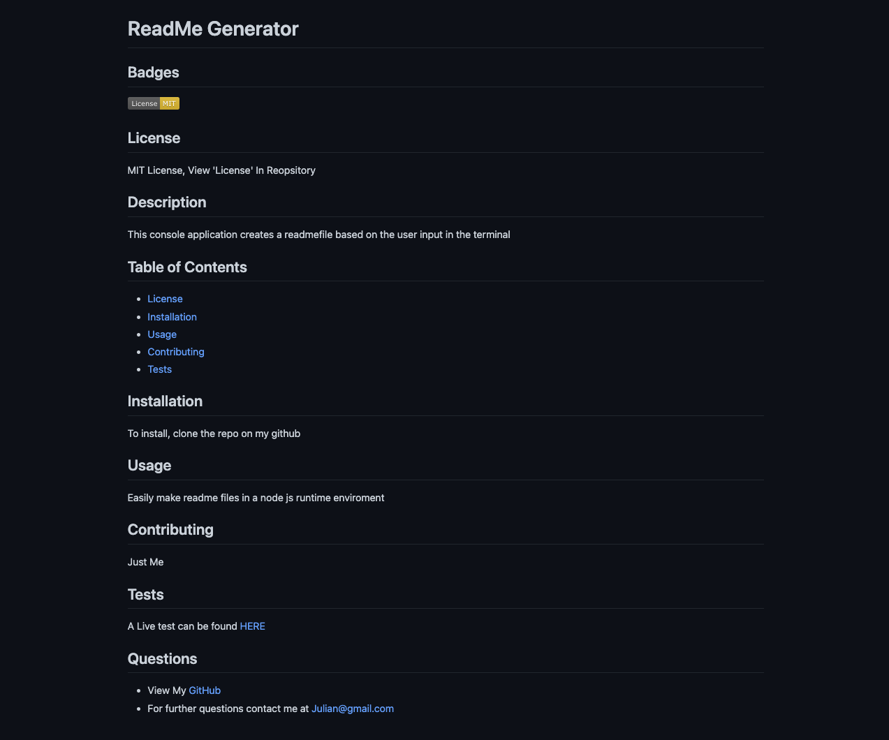

# Command Line README Generator

## Description

This application creates a README file base on the user input in the terminal

## User Story

As a developer, I want a README generator, So I can quickly create a professional README for a new project.

## Acceptance Criteria

GIVEN a command-line application that accepts user input:

-When I am prompted for information about my application repository, then a high-quality, professional README.md is generated with the title of my project and sections entitled Description, Table of Contents, Installation, Usage, License, Contributing, Tests, and Questions.

-When I enter my project title, then this is displayed as the title of the README.

-When I enter a description, installation instructions, usage information, contribution guidelines, and test instructions, then this information is added to the sections of the README entitled Description, Installation, Usage, Contributing, and Tests.

-When I choose a license for my application from a list of options, then a badge for that license is added near the top of the README and a notice is added to the section of the README entitled License that explains which license the application is *covered under.

-When I enter my GitHub username, then this is added to the section of the README entitled Questions, with a link to my GitHub profile.

-When I enter my email address, then this is added to the section of the README entitled Questions, with instructions on how to reach me with additional questions.

-When I click on the links in the Table of Contents, then I am taken to the corresponding section of the README.

## Mock-Up

The following animation demonstrates the application functionality:

## Live Demo

A Live Demo Can be Found [Here](https://julianmlacey.github.io/ReadMeGenerator/)

## License

View "LICENSE" in Repository
